# FeelApp

It is the music application. It contains that:
- All music in application seperated emotion according to accustics. And the user can search music with saying their current emotion.
- The application finds the currently playing music and opens that music video.
- The application contains some radio seperated emotions and the user can see what the currently music in the radio.
- The user can playing music game (10 questions, 90 minutes).
- The user can like, delete, search and listen music anytime.

The application uses MySql for saving user credential data(password,email,name and profile picture) and the selected emotions (calm,energetic,joyful,dreamy) musics and also liked, last, searched musics lastly date the user first entered.

## Splash Screen

## Authentification Manager

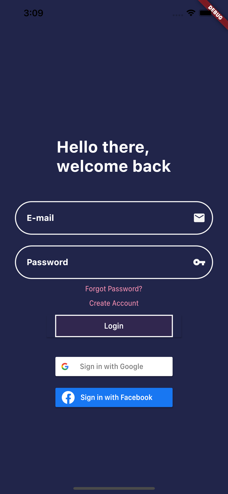 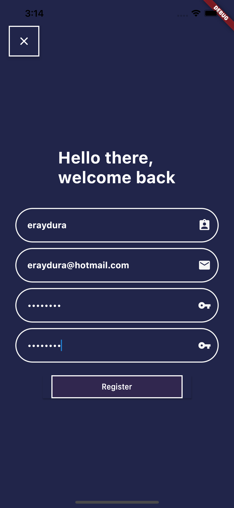 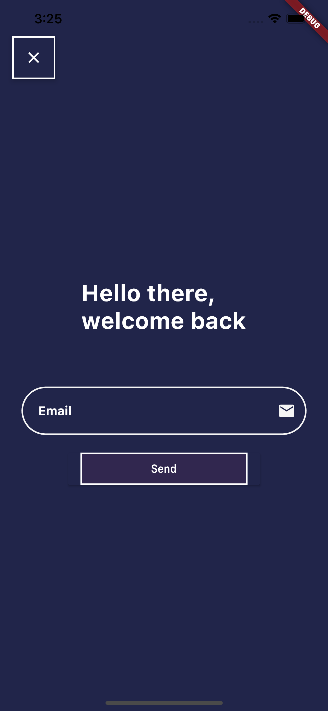 

### Google & Facebook Sign in

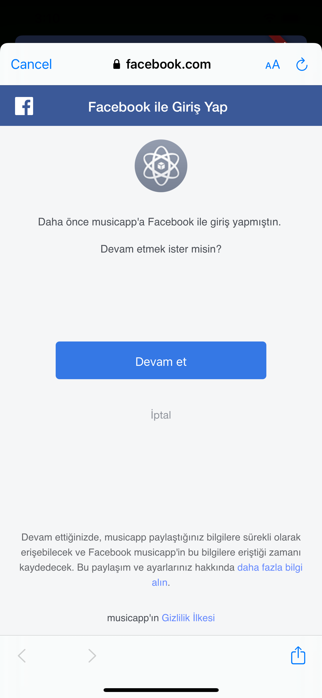 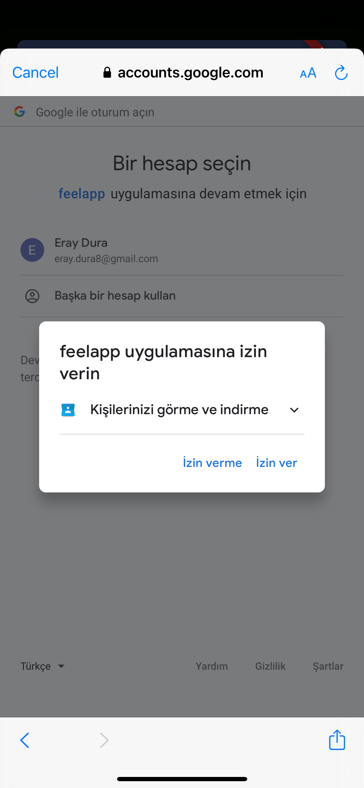 

## Music Selection Manager

 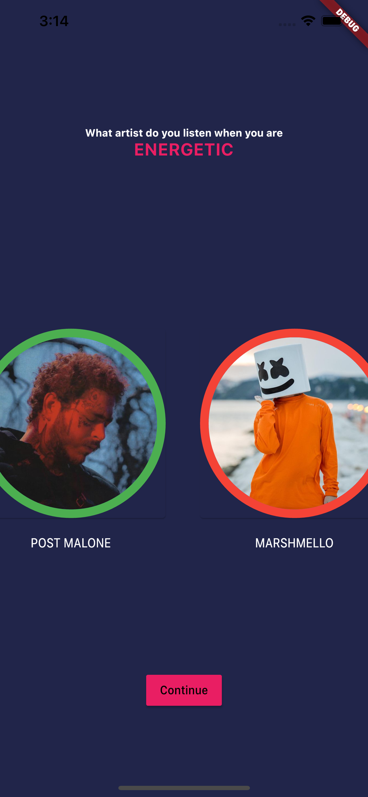

## Main Screen & Music Player & Music Searching

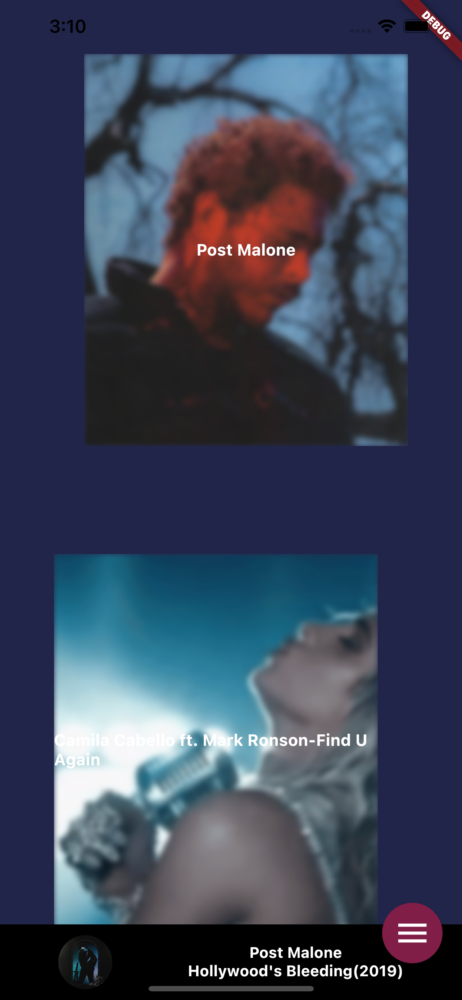 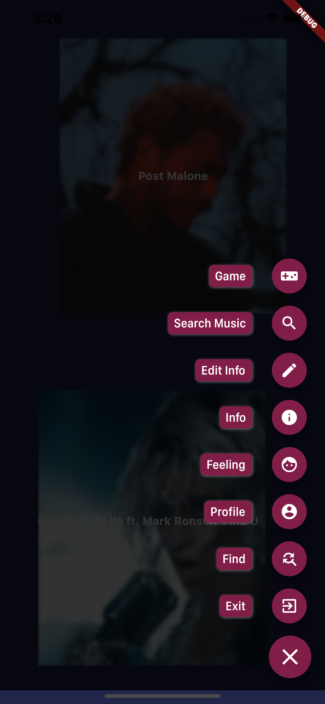 
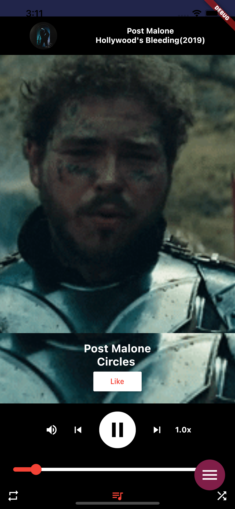 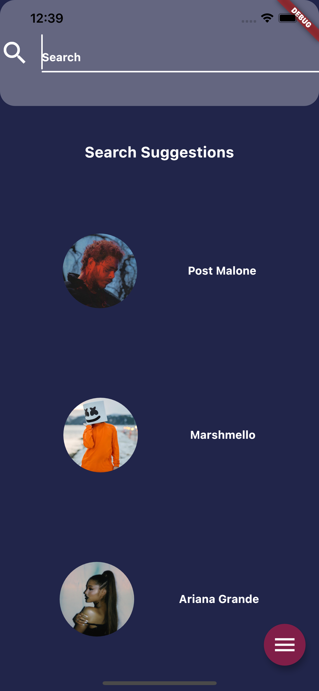 

## Feeling Search Manager

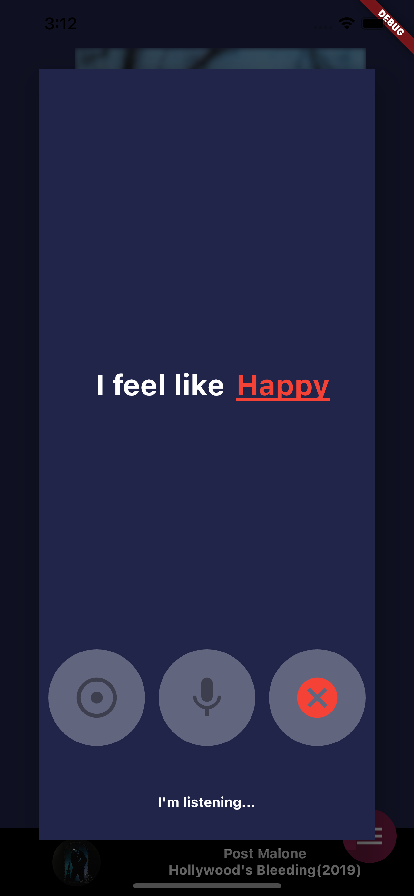  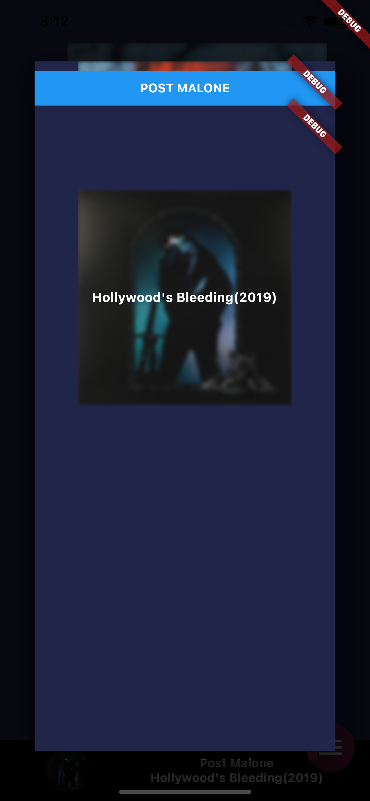 

## Profile Manager

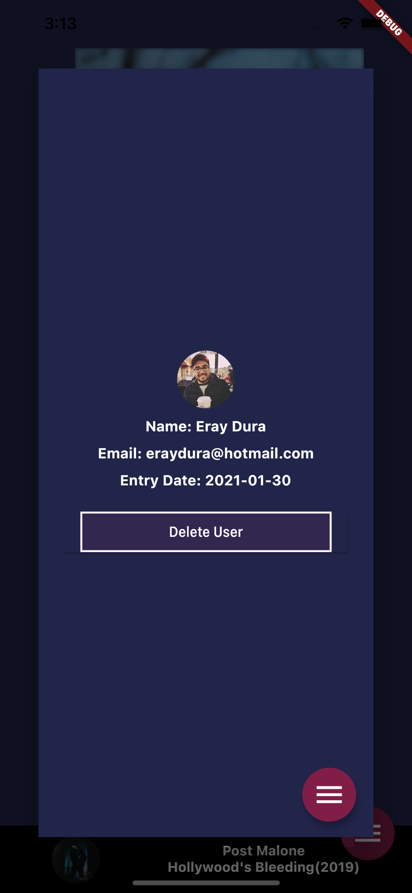 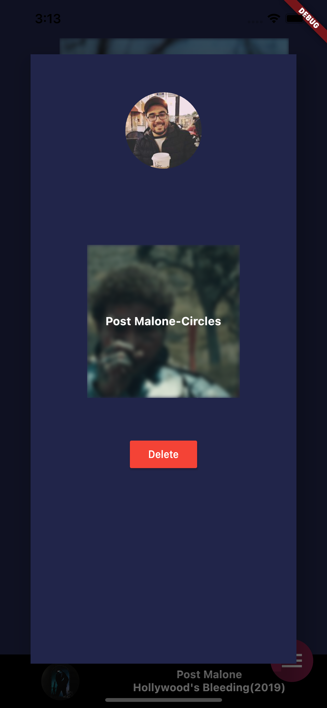 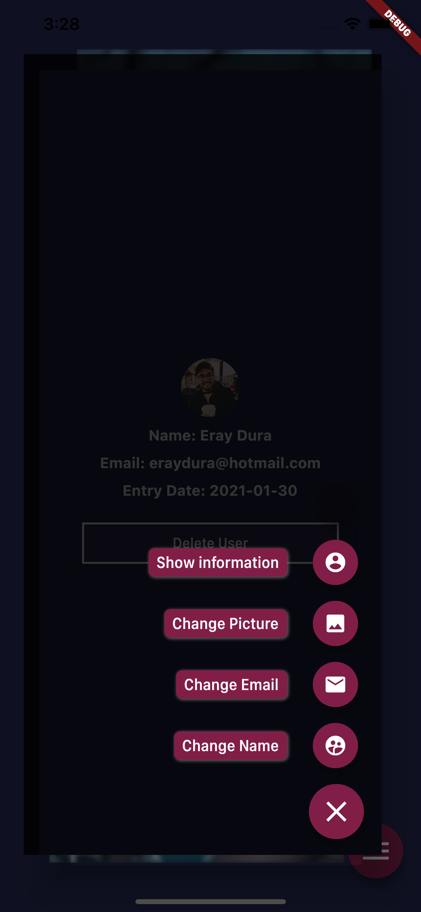 

## Music-Game Manager

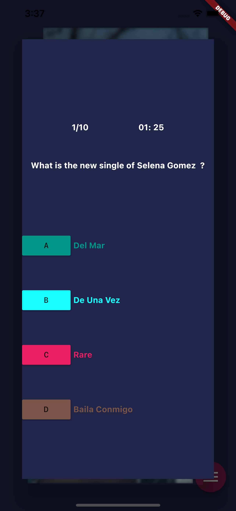 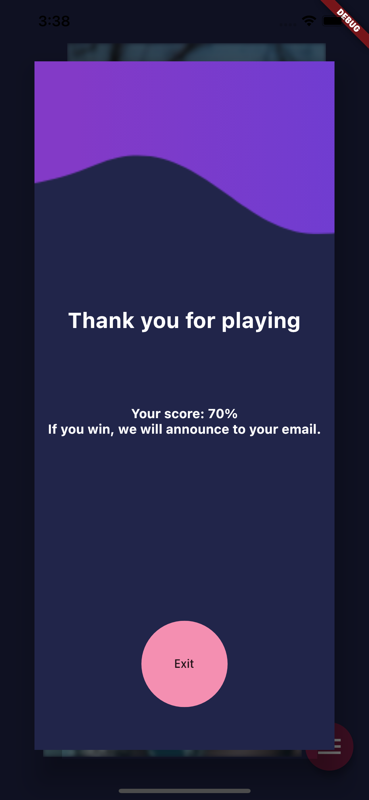 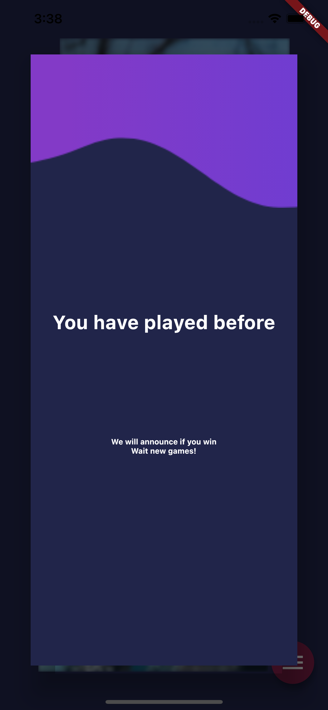 

## Find-Music Manager

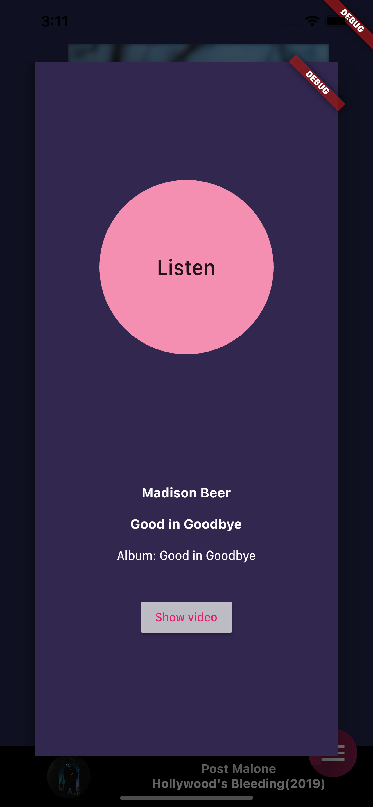 
